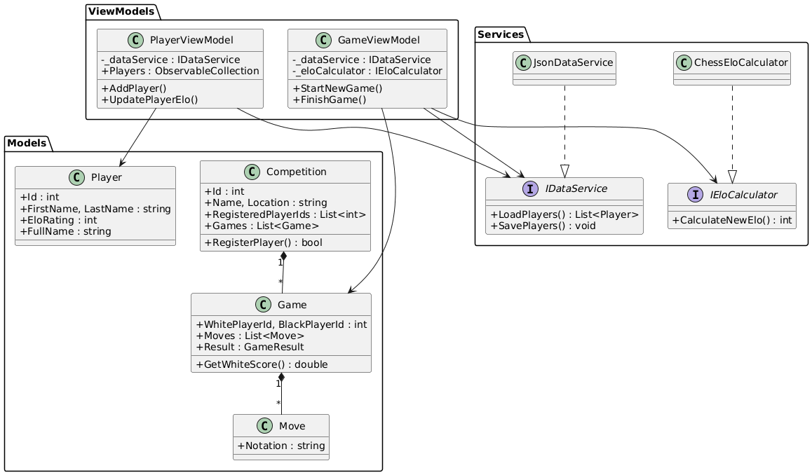
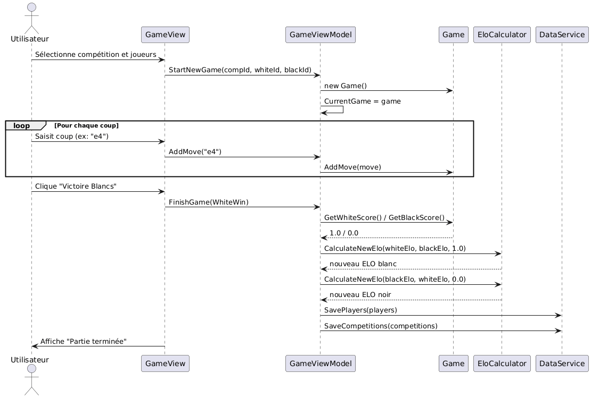

# Rapport - Chess DB

**Auteur :** Pauwels Victor [23203]  
**Date :** 19 Décembre 2025

---

## 1. Introduction

### Contexte

Ce projet consiste à créer une application de gestion des joueurs, des compétitions et des matchs pour une fédération d'échecs. L'application est destinée au personnel administratif de la fédération qui l'utilisera pour gérer les joueurs, les compétitions et l'encodage des parties.

### Objectifs

L'application doit permettre de :

- Gérer les informations personnelles des joueurs
- Gérer les compétitions et inscrire les joueurs
- Encoder les parties avec notation d'échecs et résultats
- Calculer automatiquement le classement ELO
- Sauvegarder les données de façon persistante dans un fichier JSON
- Offrir des statistiques et un classement (fonctionnalité supplémentaire)

De plus, le code a été conçu pour être facilement adaptable à d'autres fédérations sportives.

---

## 2. Fonctionnalité supplémentaire : Statistiques et Classement

### Description

J'ai implémenté un module de statistiques complet. Ce module se divise en trois niveaux d'information.

Au niveau global, une vue d'ensemble affiche le nombre total de joueurs inscrits, le nombre de parties jouées, l'ELO moyen de tous les joueurs, ainsi que l'identification automatique du meilleur joueur.

Le classement par ELO constitue le cœur du module. Les joueurs sont automatiquement triés par ELO du meilleur au moins bon.

Enfin, au niveau individuel, en cliquant sur un joueur dans le classement, l'utilisateur accède à des statistiques détaillées : nombre total de parties jouées, répartition victoires/défaites/nuls, taux de performance exprimés en pourcentages, et historique des 10 dernières parties avec leurs résultats.

## 3. Architecture - Pattern MVVM

L'application repose sur le pattern **Model-View-ViewModel** (MVVM), qui structure le code en trois couches distinctes ayant chacune une responsabilité précise.

La couche **Model** contient les classes de données métier (Player, Competition, Game, Move). Ces classes représentent les entités du domaine et leurs relations, sans aucune logique d'interface utilisateur.

La couche **View** regroupe les interfaces utilisateur définies en XAML (PlayerView, CompetitionView, GameView, StatisticsView). Ces vues sont purement déclaratives et ne contiennent aucune logique métier.

La couche **ViewModel** fait le lien entre les deux précédentes. Les classes PlayerViewModel, GameViewModel et CompetitionViewModel gèrent la logique de présentation, préparent les données pour l'affichage, et réagissent aux interactions utilisateur.

Cette architecture présente plusieurs avantages significatifs. La séparation claire des responsabilités facilite la maintenance du code car chaque composant a un rôle bien défini. Les ViewModels peuvent être testés unitairement sans dépendre de l'interface graphique, améliorant ainsi la testabilité. Enfin, la modification de l'interface utilisateur peut se faire sans toucher à la logique métier, et inversement, garantissant une grande maintenabilité du projet.

---

## 4. Diagramme de classes



Le diagramme montre les relations entre les principales classes du système :

- Les **Models** contiennent les données
- Les **Services** gèrent la logique métier
- Les **ViewModels** font le lien avec les vues

---

## 5. Diagramme de séquence



Ce diagramme illustre le processus complet d'encodage d'une partie :

1. Sélection de la compétition et des joueurs
2. Démarrage de la partie
3. Ajout des coups
4. Sélection du résultat
5. Calcul des nouveaux ELO
6. Sauvegarde des données

---

## 6. Diagramme d'activité


Le diagramme d'activité illustre le flux complet d'encodage d'une partie d'échecs, depuis la sélection des participants jusqu'à la sauvegarde des résultats. Ce processus se déroule en plusieurs étapes clés.

Après avoir sélectionné une compétition et les deux joueurs participants, l'utilisateur démarre la partie et entre dans la phase d'ajout des coups. L'utilisateur encode tous les coups un par un jusqu'à la fin de la partie.

Une fois la partie terminée et le résultat saisi, le système déclenche automatiquement le calcul des nouveaux classements ELO.

Le processus se termine par la sauvegarde de toutes les données : mise à jour des classements ELO des joueurs et enregistrement de la partie complète dans la compétition concernée.

---

## 7. Adaptabilité à une autre fédération

### Principe de conception

Le code a été conçu avec des **interfaces** pour permettre l'adaptabilité.

L'interface `IEloCalculator` définit le contrat pour tout système de calcul de classement :

```csharp
public interface IEloCalculator
{
int CalculateNewElo(int currentElo, int opponentElo, double score);
double CalculateExpectedScore(int playerElo, int opponentElo);
}
```

De la même manière, l'interface `IDataService` abstrait la gestion de la persistance des données :

```csharp
public interface IDataService
{
List<Player> LoadPlayers();
void SavePlayers(List<Player> players);
// ...
}
```

### Adaptation à une fédération de Tennis

Pour adapter l'application au tennis, le processus est remarquablement simple grâce à l'architecture mise en place. Il suffit tout d'abord de créer une nouvelle classe `TennisRankingCalculator` qui implémente l'interface `IEloCalculator` avec les règles spécifiques du système ATP/WTA. Ensuite, au niveau de l'injection de dépendances, une seule ligne de code doit être modifiée dans la classe d'initialisation : remplacer l'instanciation de `ChessEloCalculator` par celle de `TennisRankingCalculator`.

Ce qui est vraiment pratique, c'est que les ViewModels et les Views restent totalement inchangés. Seule la logique métier spécifique au sport nécessite une adaptation, sans aucune modification des interfaces existantes.

---

## 8. Principes SOLID

### Principe S - Single Responsibility

Le principe de responsabilité unique stipule qu'une classe ne doit avoir qu'une seule raison de changer.

La classe `Player` illustre parfaitement ce principe en ayant une seule responsabilité : stocker les données d'un joueur. Elle contient uniquement les propriétés descriptives comme l'identifiant, le nom, la date de naissance et le classement ELO :

```csharp
public class Player
{
public int Id { get; set; }
public string FirstName { get; set; }
public string LastName { get; set; }
public int EloRating { get; set; }
// ...
}
```

Le calcul de l'ELO, qui représente une responsabilité différente, est entièrement délégué à une classe spécialisée `ChessEloCalculator` :

```csharp
public class ChessEloCalculator : IEloCalculator
{
public int CalculateNewElo(int currentElo, int opponentElo, double score)
{
// Logique de calcul
}
}
```

Cette séparation présente des avantages concrets en termes de maintenance. Si la formule de calcul ELO évolue, seule la classe `ChessEloCalculator` nécessite une modification, laissant la classe `Player` intacte. Inversement, si la structure des données d'un joueur change, cela n'affecte en rien la logique de calcul.

---

### Principe D - Dependency Inversion

Le principe d'inversion de dépendances établit que les modules de haut niveau ne doivent pas dépendre des modules de bas niveau, mais que les deux doivent dépendre d'abstractions.

Dans l'implémentation, les ViewModels ne dépendent jamais des classes concrètes comme `JsonDataService` ou `ChessEloCalculator`. Ils dépendent uniquement des interfaces `IDataService` et `IEloCalculator`:

```csharp
public class PlayerViewModel
{
private readonly IDataService _dataService; // Interface
private readonly IEloCalculator _eloCalculator; // Interface

    public PlayerViewModel(IDataService dataService, IEloCalculator eloCalculator)
    {
        _dataService = dataService;
        _eloCalculator = eloCalculator;
    }

}
```

Cette approche offre une flexibilité considérable. Il devient possible de remplacer `JsonDataService` par une implémentation `SqlDataService` sans toucher une seule ligne de code dans `PlayerViewModel`. De même, `ChessEloCalculator` peut être substitué par `TennisRankingCalculator` de manière transparente.

---

## 9. Conclusion

Ce projet m’a permis de réaliser une application complète et cohérente pour la gestion d’une fédération d’échecs. J’ai cherché à construire une solution claire et bien organisée, capable d’évoluer sans devoir être repensée entièrement. Les choix d’architecture effectués tout au long du développement rendent l’application facile à maintenir et adaptable à d’autres contextes sportifs.
